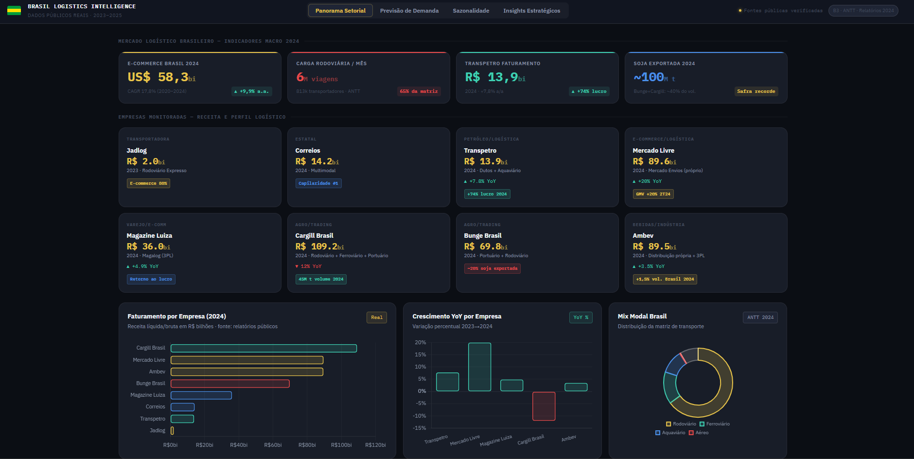

# 🚚 Brasil Logistics Intelligence Dashboard

## 🌐 Dashboard Online

[🚛 Abrir Dashboard Interativo](https://callout84.github.io/brasil-logistics-intelligence-dashboard/)

---

# 📌 Sobre o Projeto

O Brasil Logistics Intelligence Dashboard é um projeto de análise de dados e inteligência de negócios voltado para o setor logístico brasileiro.

O objetivo foi transformar dados públicos de empresas e do mercado de logística em uma plataforma visual interativa capaz de apoiar análises estratégicas e tomada de decisão executiva.

O dashboard consolida indicadores de transporte, e-commerce, agronegócio, energia e distribuição, permitindo visualizar tendências de mercado, sazonalidade operacional, previsões de demanda e riscos logísticos.

---

# 🎯 Problema de Negócio

A logística é um dos pilares da economia brasileira.

Empresas enfrentam diariamente desafios relacionados a:

- Crescimento do e-commerce
- Gargalos de transporte
- Sazonalidade operacional
- Custos logísticos
- Planejamento de demanda
- Capacidade de distribuição

Este projeto busca responder perguntas como:

- Quais setores estão impulsionando a demanda logística?
- Onde existem riscos de gargalos operacionais?
- Quais empresas apresentam maior crescimento?
- Como a sazonalidade impacta a cadeia de suprimentos?
- Quais regiões devem receber maior pressão logística nos próximos anos?

---

# 📊 Principais Análises

## Panorama Setorial

Análise dos principais indicadores logísticos do Brasil:

- Mercado de e-commerce
- Transporte rodoviário
- Agronegócio
- Energia e petróleo
- Distribuição nacional

---

## Benchmark Empresarial

Monitoramento de empresas relevantes do setor:

- Jadlog
- Correios
- Mercado Livre
- Transpetro
- Cargill
- Bunge
- Magazine Luiza
- Ambev

---

## Forecast de Demanda

Modelagem visual de crescimento dos principais segmentos:

- E-commerce
- Agronegócio
- Petróleo
- Bebidas

---

## Sazonalidade Logística

Identificação dos períodos críticos de operação:

- Black Friday
- Natal
- Safra agrícola
- Carnaval
- Exportações

---

## Inteligência Estratégica

Construção de insights executivos sobre:

- Riscos operacionais
- Oportunidades de crescimento
- Capacidade logística
- Concentração de mercado
- Corredores de transporte

---

# 🛠️ Tecnologias Utilizadas

- HTML5
- CSS3
- JavaScript
- Chart.js
- Design Responsivo
- Storytelling Analítico
- Data Visualization

---

# 📈 Competências Demonstradas

Este projeto demonstra conhecimentos em:

### Análise de Dados

- KPI Design
- Business Intelligence
- Storytelling com Dados
- Análise Exploratória

### Visualização

- Dashboards Executivos
- UX para Dados
- Design de Informação

### Negócio

- Supply Chain
- Logística
- Planejamento de Demanda
- Inteligência de Mercado

---

# 💡 Insight de Negócio

Uma das análises mais relevantes identificadas foi a sobreposição de picos de demanda entre:

- E-commerce
- Agronegócio
- Distribuição de bebidas

Esse comportamento aumenta significativamente o risco de gargalos operacionais e pressiona a capacidade logística nacional durante períodos específicos do ano.

---

# 🤖 Uso de Inteligência Artificial

Sou estudante de Data Science e utilizo Inteligência Artificial como ferramenta de apoio ao aprendizado e desenvolvimento de projetos.

Neste projeto utilizei IA para:

- Explorar hipóteses de negócio
- Aprimorar visualizações
- Refinar o storytelling analítico
- Estruturar dashboards executivos
- Acelerar prototipação de interfaces

Todo o conteúdo foi revisado, estudado e compreendido durante o desenvolvimento.

A IA foi utilizada como suporte ao processo de aprendizagem e não como substituição do entendimento técnico.

---

# 🎓 Sobre Mim

Atualmente estudo Data Science e Analytics com foco em:

- SQL
- Python
- Power BI
- Business Intelligence
- Data Visualization
- Storytelling com Dados

Meu objetivo é construir experiência prática através de projetos que simulem desafios reais de negócio e me preparem para oportunidades profissionais como Analista de Dados, evoluindo posteriormente para Data Science.

---

# 📂 Estrutura do Projeto
